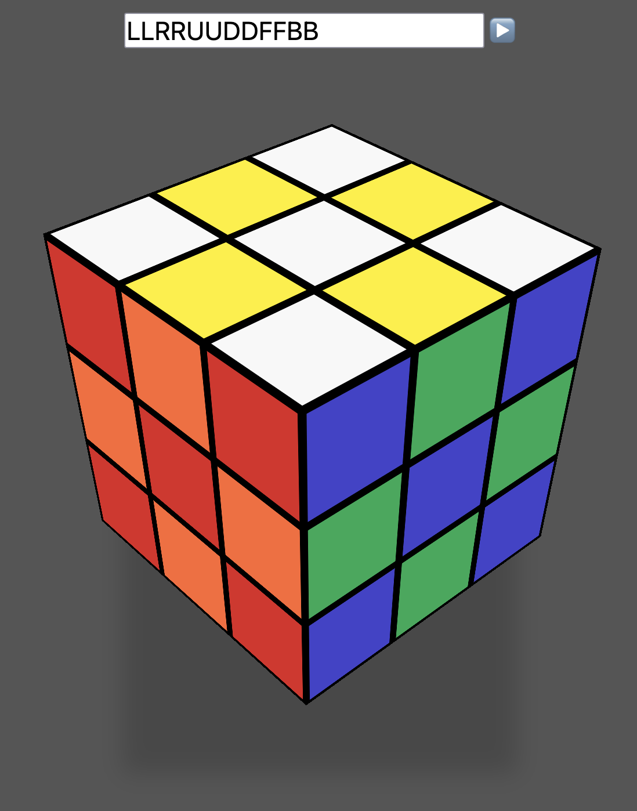

# 3D Cube

*Simple implementation of Rubik’s 3x3 cube.*

Turn layer with the keys `U`, `L`, `R`, `D`, `F` and `B`.

Or enter a sequence in the input field and press ▶️ to execute it.

Rotate the whole cube by moving the mouse while holding the left button.
